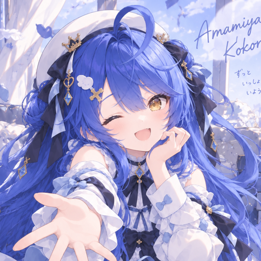

<div align="center">



# KokoroBox

Native sing-box client for Apple platforms with Kokoro integration.

**Client:** 1.14.4 (17) · **Core:** 1.15.0-alpha.6

</div>

KokoroBox is based on [sing-box for Apple](https://github.com/SagerNet/sing-box-for-apple). It supports iOS, iPadOS, and macOS under the primary bundle identifier `com.amamiyakokoro.box`.

## Features

- Local and remote sing-box profiles with validation, custom User-Agent support, and safe configuration reloads
- Server-driven Kokoro subscriptions and default Custom Rules editing
- System-browser osu! OAuth with mandatory PKCE S256 and Keychain token storage
- Public IP, network quality, STUN, interface, route-table, and runtime diagnostics
- Network Extension and standalone macOS modes

## Build

Clone with submodules, then open `sing-box.xcodeproj` and select `KokoroBoxI` (iOS/iPadOS) or `KokoroBoxM`/`SFM.System` (macOS).

```bash
git clone --recurse-submodules https://github.com/amamiyakokoro/KokoroBox-iOS.git
cd KokoroBox-iOS
make build_ios
make build_macos
swift test
```

Signed builds require a compatible `Libbox.xcframework`, an Apple Developer team, and matching App Group, Network Extension, and provisioning settings. Run Kokoro API and authentication tests with `swift test`.

Implementation details: [OAuth and PKCE](docs/kokoro-oauth.md) · [Custom Rules](docs/kokoro-custom-rules.md) · [App Store Connect CI](docs/app-store-connect-ci.md) · [Privacy Policy](PRIVACY_POLICY.md)

## License

[GNU General Public License v3 or later](LICENSE). Dependencies retain their respective licenses.
